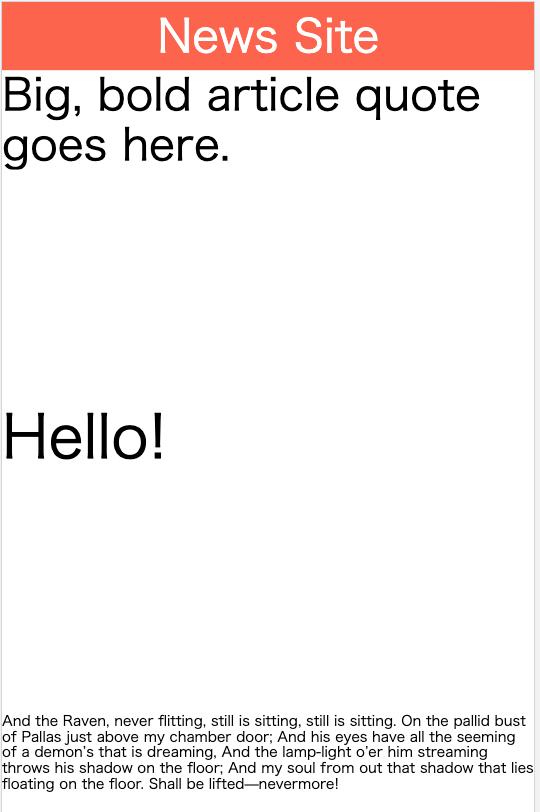

# Add Advanced AMP Features

See [official tutorial](https://amp.dev/ja/documentation/guides-and-tutorials/start/add_advanced/index.html).

## AMP Component Kinds

+ built-in
  + e.g. `amp-img`, `amp-pixel`
+ extended
  + e.g. `amp-video`, `amp-story`, `amp-ad`
  + Write like `<script async custom-element="amp-video" ...` in `<head>` section to use
+ experimental

## amp-ad

An extended component.

## amp-youtube

An extended component.

### Required script

```html
<script async custom-element="amp-youtube" src="https://cdn.ampproject.org/v0/amp-youtube-0.1.js"></script>
```

### Usage

```html
<amp-youtube
  data-videoid="npum8JsITQE"
  layout="responsive"
  width="480"
  height="270">
  <div fallback>
    <p>The video could not be loaded.</p>
  </div>
</amp-youtube>
```

## amp-twitter

### Required script

```html
<script async custom-element="amp-twitter" src="https://cdn.ampproject.org/v0/amp-twitter-0.1.js"></script>
```

### Usage

```html
<amp-twitter
  width="486"
  height="657"
  layout="responsive"
  data-tweetid="1116339802360516608">
</amp-twitter>
```

## amp-fit-text

See [https://amp.dev/ja/documentation/examples/components/amp-fit-text/index.html?format=websites](https://amp.dev/ja/documentation/examples/components/amp-fit-text/index.html?format=websites) for details.

### Required script

```html
<script async custom-element="amp-fit-text" src="https://cdn.ampproject.org/v0/amp-fit-text-0.1.js"></script>
```

### Usage

```html
<amp-fit-text width="400" height="75" layout="responsive" max-font-size="42">
      Big, bold article quote goes here.
    </amp-fit-text>

    <amp-fit-text width="400" height="400" layout="responsive" max-font-size="42">
       Hello!
    </amp-fit-text>

    <amp-fit-text width="400" height="75" layout="responsive" max-font-size="42">
        And the Raven, never flitting, still is sitting, still is sitting. On the pallid bust of Pallas just above my chamber door; And his eyes have all the seeming of a demon’s that is dreaming, And the lamp-light o’er him streaming throws his shadow on the floor; And my soul from out that shadow that lies floating on the floor. Shall be lifted—nevermore!
    </amp-fit-text>
```



## amp-carousel

## amp-analytics

## amp-sidebar
